---
## Front matter
title: "Отчет по лабораторной работе №3"
subtitle: "*дисциплина: Архитектура компьютера*"
author: "Галацан Николай, НПИбд-01-22"

## Generic otions
lang: ru-RU
toc-title: "Содержание"

## Bibliography
bibliography: bib/cite.bib
csl: pandoc/csl/gost-r-7-0-5-2008-numeric.csl

## Pdf output format
toc: true # Table of contents
toc-depth: 2
lof: true # List of figures
fontsize: 12pt
linestretch: 1.5
papersize: a4
documentclass: scrreprt
## I18n polyglossia
polyglossia-lang:
  name: russian
  options:
	- spelling=modern
	- babelshorthands=true
polyglossia-otherlangs:
  name: english
## I18n babel
babel-lang: russian
babel-otherlangs: english
## Fonts
mainfont: PT Serif
romanfont: PT Serif
sansfont: PT Sans
monofont: PT Mono
mainfontoptions: Ligatures=TeX
romanfontoptions: Ligatures=TeX
sansfontoptions: Ligatures=TeX,Scale=MatchLowercase
monofontoptions: Scale=MatchLowercase,Scale=0.9
## Biblatex
biblatex: true
biblio-style: "gost-numeric"
biblatexoptions:
  - parentracker=true
  - backend=biber
  - hyperref=auto
  - language=auto
  - autolang=other*
  - citestyle=gost-numeric
## Pandoc-crossref LaTeX customization
figureTitle: "Рис."
tableTitle: "Таблица"
listingTitle: "Листинг"
lofTitle: "Список иллюстраций"
lolTitle: "Листинги"
## Misc options
indent: true
header-includes:
  - \usepackage{indentfirst}
  - \usepackage{float} # keep figures where there are in the text
  - \floatplacement{figure}{H} # keep figures where there are in the text
---

# Цель работы

Изучить идеологию и применение средств контроля версий. Приобрести
практические навыки по работе с системой git.

# Выполнение лабораторной работы

Создаю учетную запись на сайте репозитория Github (https://github.com/) и заполняю основные данные (рис. [-@fig:1]).

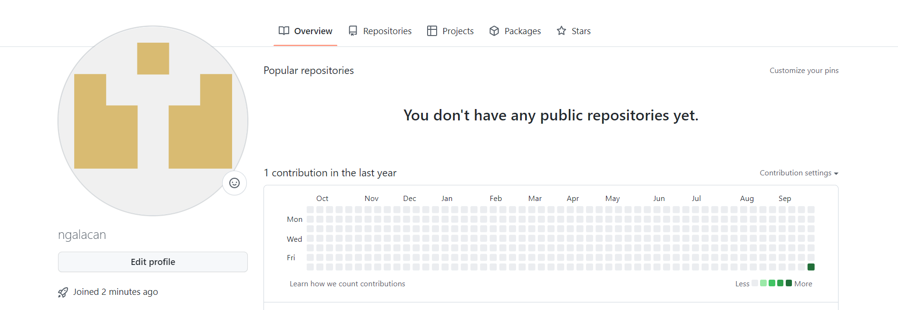{ #fig:1 width=70% }

Делаю предварительную конфигурацию git (рис. [-@fig:2]). Открываю терминал и ввожу команды, указав имя и email владельца репозитория:

`git config --global user.name "ngalacan"`

`git config --global user.email "1032225763@pfur.ru"`

Настраиваю utf-8 в выводе сообщений git:

`git config --global core.quotepath false`

Задаю имя начальной ветки (master):

`git config --global init.defaultBranch master`

Параметр autocrlf:

`git config --global core.autocrlf input`

Параметр safecrlf:

`git config --global core.safecrlf warn`

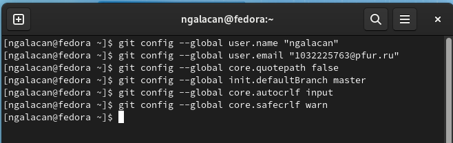{ #fig:2 width=70% }

Генерирую ключи для идентификации пользователя на сервере репозиториев (рис. [-@fig:3]).

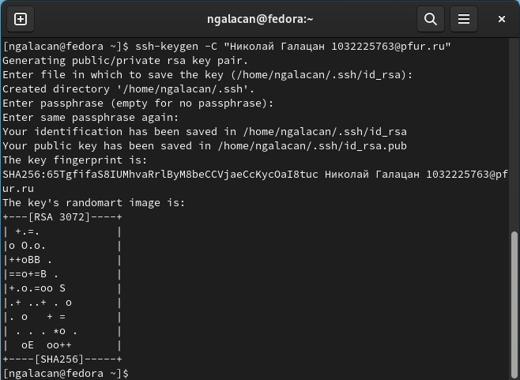{ #fig:3 width=70% }

Загружаю открытый ключ на Github. На сайте перехожу *Setting => SSH and
GPG keys => New SSH key*.
Ввожу в терминал `cat ~/.ssh/id_rsa.pub | xclip -sel clip` и копирую ключ. Вставляю в появившееся на сайте поле скопированный ключ и указываю имя (рис. [-@fig:4]).

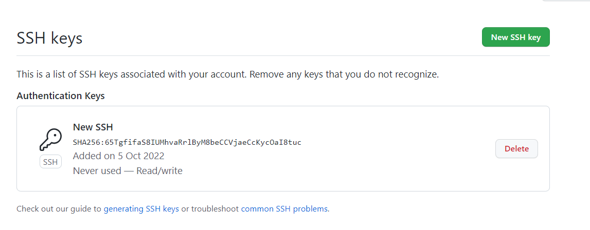{ #fig:4 width=70% }

Создаю через терминал каталог для предмета «Архитектура компьютера» (рис. [-@fig:5]).

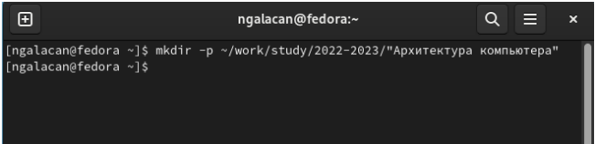{ #fig:5 width=70% }

Перехожу на страницу репозитория с шаблоном курса https://github.com/yam
adharma/course-directory-student-template. Далее выбираю *Use this template*. В
открывшемся окне задаю имя репозитория *study_2022–2023_arh-pc* и создаю
репозиторий (рис. [-@fig:6]).

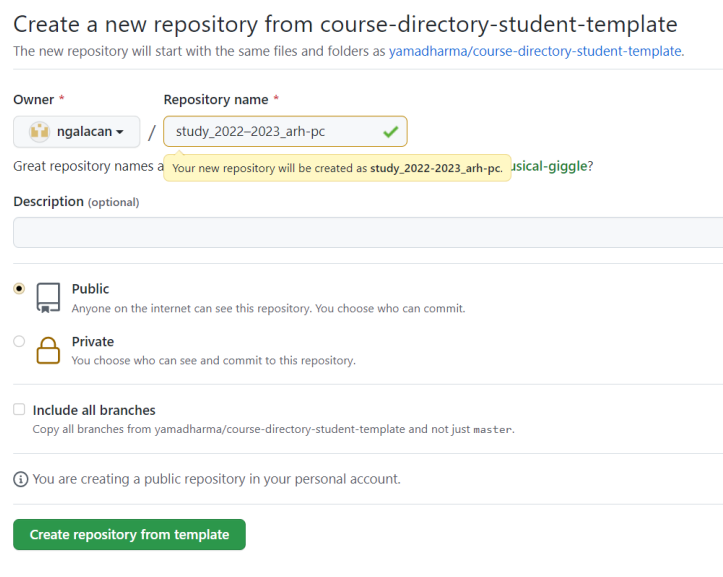{ #fig:6 width=70% }

Перехожу в каталог курса, введя `cd ~/work/study/2022-2023/"Архитектура компьютера"` и клонирую созданный репозиторий (рис. [-@fig:7]):

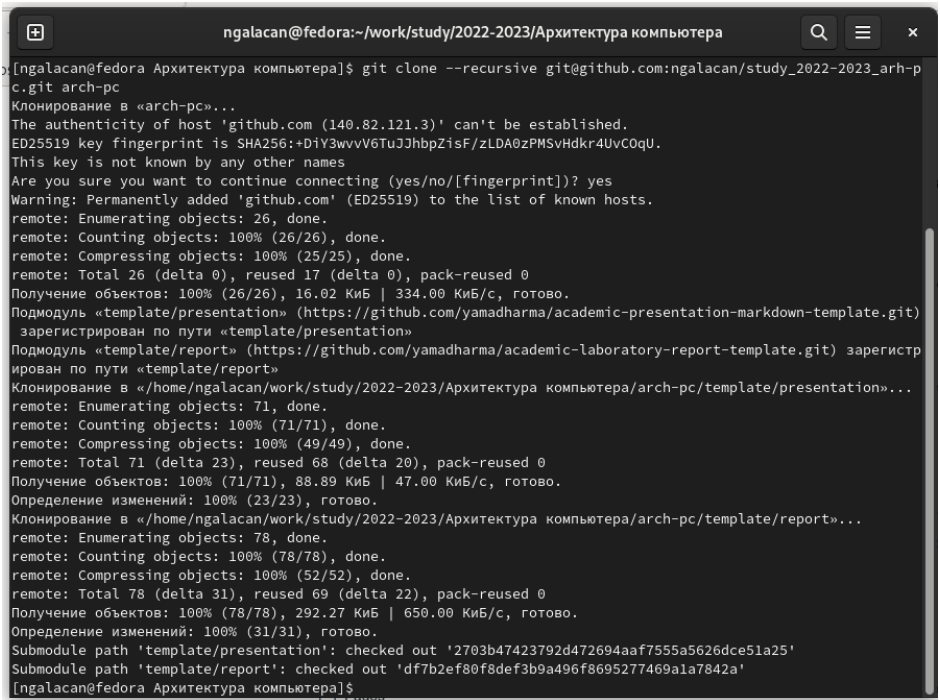{ #fig:7 width=70% }

Перехожу в каталог курса и удаляю лишние файлы, используя команды `cd` и `rm`. Создаю необходимые каталоги и отправляю файлы на сервер (рис. [-@fig:8], рис.[-@fig:9]):

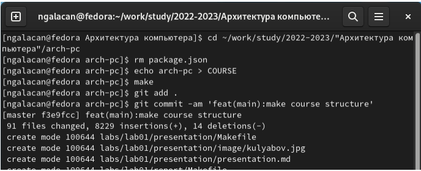{ #fig:8 width=70% }

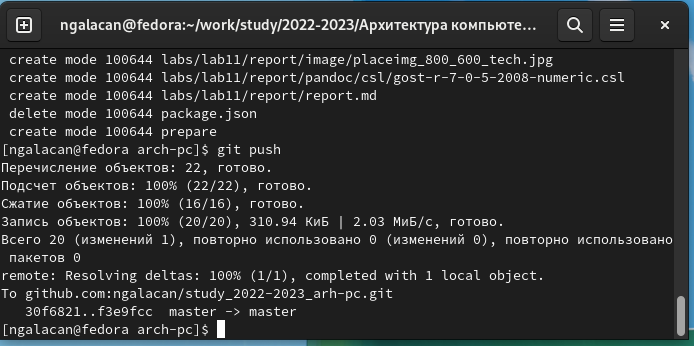{ #fig:9 width=70% }

Проверяю правильность создания иерархии рабочего пространства в локальном репозитории и на странице github (рис. [-@fig:10], рис. [-@fig:11]):

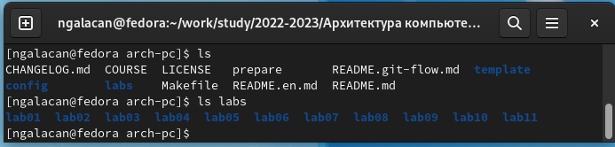{ #fig:10 width=70% }

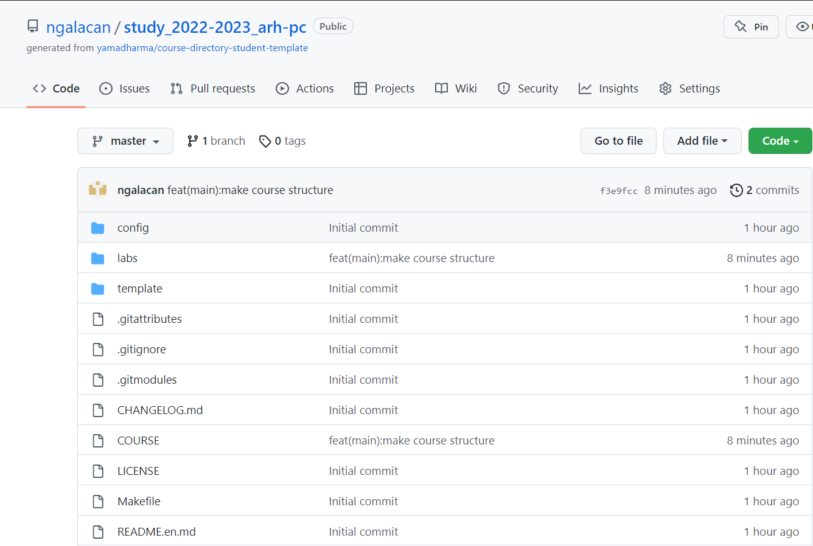{ #fig:11 width=70% }

Файлы соответствуют.

# Выполнение заданий для самостоятельной работы

1. Создаю отчет по выполнению лабораторной работы в соответствующем каталоге рабочего пространства (labs>lab03>report).

2. Копирую отчеты по выполнению лабораторных работ 1 и 2 в соответствующие каталоги созданного рабочего пространства (рис. [-@fig:12]).

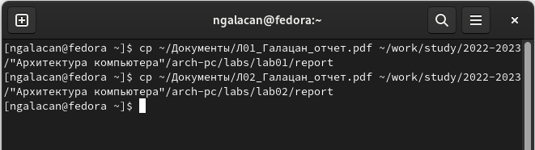{ #fig:12 width=70% }

3. Загружаю файлы на github (рис. [-@fig:13])

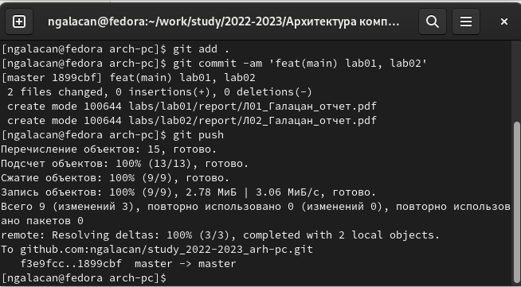{ #fig:13 width=70% }

Проверяю наличие файлов на github. Файлы перенесены успешно.

Аналогичным способом, как на рис. [-@fig:13], загружу на github данный отчет.

# Выводы

Была изучена идеология и применение средств контроля версий. Была настроена система git. Приобретены практические навыки по работе с системой git.

