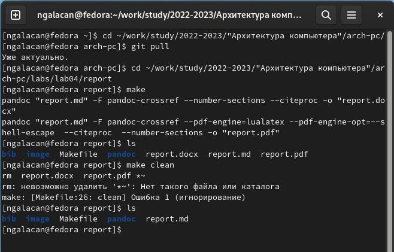
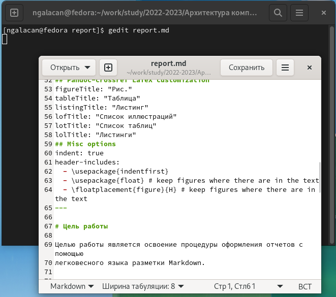
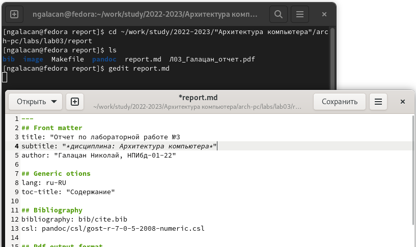
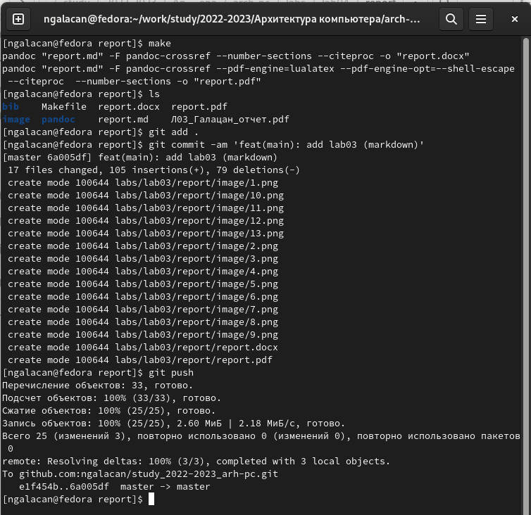

---
## Front matter
title: "Отчет по лабораторной работе №4"
subtitle: "*дисциплина: Архитектура компьютера*"
author: "Галацан Николай, НПИбд-01-22"

## Generic otions
lang: ru-RU
toc-title: "Содержание"

## Bibliography
bibliography: bib/cite.bib
csl: pandoc/csl/gost-r-7-0-5-2008-numeric.csl

## Pdf output format
toc: true # Table of contents
toc-depth: 2
lof: true # List of figures
fontsize: 12pt
linestretch: 1.5
papersize: a4
documentclass: scrreprt
## I18n polyglossia
polyglossia-lang:
  name: russian
  options:
	- spelling=modern
	- babelshorthands=true
polyglossia-otherlangs:
  name: english
## I18n babel
babel-lang: russian
babel-otherlangs: english
## Fonts
mainfont: PT Serif
romanfont: PT Serif
sansfont: PT Sans
monofont: PT Mono
mainfontoptions: Ligatures=TeX
romanfontoptions: Ligatures=TeX
sansfontoptions: Ligatures=TeX,Scale=MatchLowercase
monofontoptions: Scale=MatchLowercase,Scale=0.9
## Biblatex
biblatex: true
biblio-style: "gost-numeric"
biblatexoptions:
  - parentracker=true
  - backend=biber
  - hyperref=auto
  - language=auto
  - autolang=other*
  - citestyle=gost-numeric
## Pandoc-crossref LaTeX customization
figureTitle: "Рис."
tableTitle: "Таблица"
listingTitle: "Листинг"
lofTitle: "Список иллюстраций"
lolTitle: "Листинги"
## Misc options
indent: true
header-includes:
  - \usepackage{indentfirst}
  - \usepackage{float} # keep figures where there are in the text
  - \floatplacement{figure}{H} # keep figures where there are in the text
---
# Цель работы

Целью работы является освоение процедуры оформления отчетов с помощью
легковесного языка разметки Markdown.

# Выполнение лабораторной работы
В первую очередь, устанавливаю необходимое ПО, так как выполняю работу на своей технике. 
Согласно инструкции устанавливаю Pandoc, Pandoc-crossref, TeX Live.

Открываю терминал и перехожу в каталог курса с помощью команды `cd ~/work/study/2022-2023/"Архитектура компьютера"/arch-pc/`. Обновляю локальный репозиторий, скачав изменения из удаленного репозитория. Перехожу в каталог с шаблоном отчета по лабораторной работе №4, введя команду `cd ~/work/study/2022-2023/"Архитектура компьютера"/arch-pc/labs/lab04/report`.

Провожу компиляцию шаблона с использованием Makefile, введя команду `make`. Проверяю, сгенерировались ли файлы report.docx и report.pdf. Ввожу команду `make clean` для удаления созданных файлов. С помощью команды `ls` проверяю, удалены ли ранее созданные шаблоны. Файлы удалены. (рис. [-@fig:1]) 

{ #fig:1 width=70% }

Открываю файл report.md с помощью текстового редактора gedit, введя `gedit report.md`. Изучаю структуру этого файла и заполняю отчет. (рис. [-@fig:2]) Скриншоты размещаю в каталоге image.
Скомпилирую готовый отчет с использованием Makefile, введя команду `make`, проверю корректность файлов. 

{ #fig:2 width=70% }

Компилирую готовый отчет с использованием Makefile, введя команду `make`, проверяю корректность файлов. 
Загружаю файлы данного отчета на Github, введя следующую последовательность команд:
```
cd ~/work/study/2022-2023/"Архитектура компьютера"/arch-pc
git add .
git commit -am 'feat(main): add files lab-4'
git push

```
# Выполнение заданий для самостоятельной работы

1. Перехожу в каталог отчета по лабораторной работе №3, введя команду `cd ~/work/study/2022-2023/"Архитектура компьютера"/arch-pc/labs/lab03/report`. Ввожу `gedit report.md` и заполняю отчет в формате Markdown согласно уже сданному отчету (рис. [-@fig:3]). Размещаю все изображения в каталоге image. Удаляю из файла report.md строки, отвечающие за создание списка таблиц и списка литературы, так как эти страницы пусты. 

{ #fig:3 width=70% }


2. Провожу компиляцию, проверяю корректность файлов, загружаю на github (рис. [-@fig:4]).

{ #fig:4 width=70% }

Ссылка на репозиторий: https://github.com/ngalacan/study_2022-2023_arh-pc.git

# Выводы

В данной лабораторной работе были освоены процедуры оформления отчетов с помощью языка разметки Markdown. Были изучены команды для форматирования текста, оформления формул, размещения изображений и другие.

