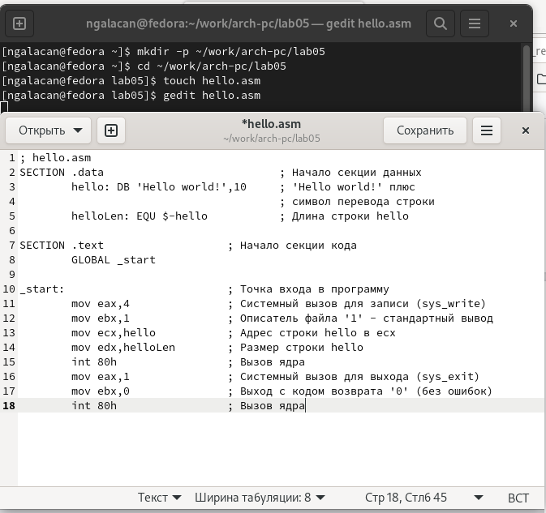
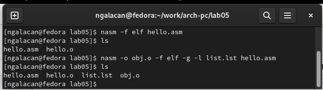
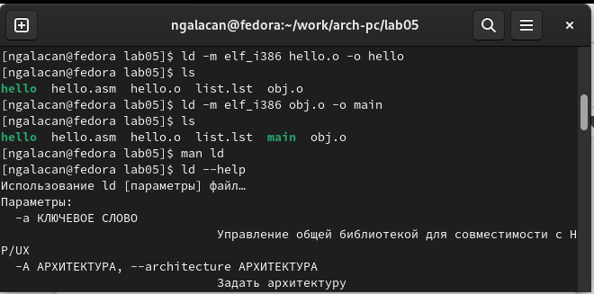
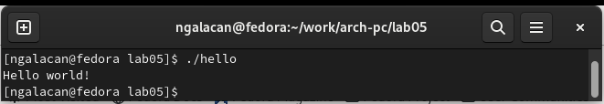
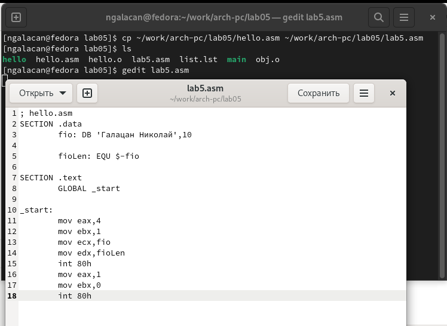
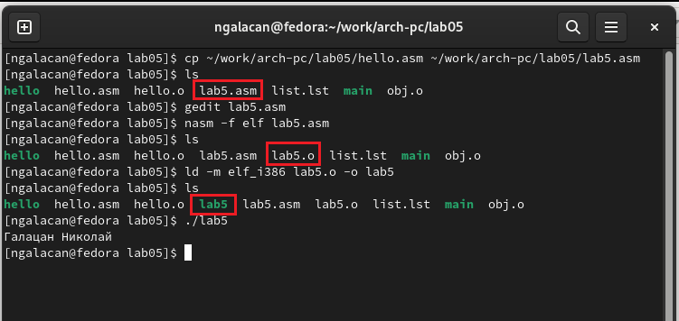
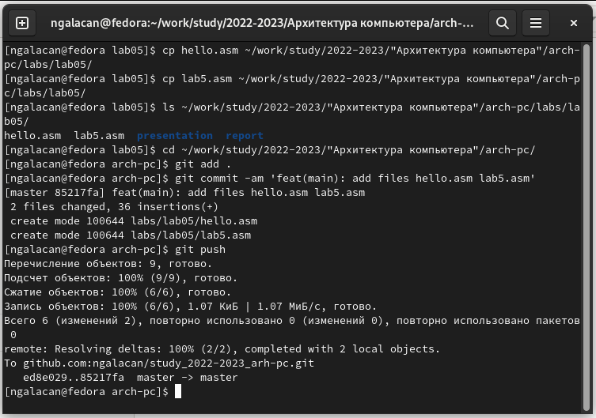

---
## Front matter
title: "Отчет по лабораторной работе №5"
subtitle: "*дисциплина: Архитектура компьютера*"
author: "Галацан Николай, НПИбд-01-22"

## Generic otions
lang: ru-RU
toc-title: "Содержание"

## Bibliography
bibliography: bib/cite.bib
csl: pandoc/csl/gost-r-7-0-5-2008-numeric.csl

## Pdf output format
toc: true # Table of contents
toc-depth: 2
lof: true # List of figures
fontsize: 12pt
linestretch: 1.5
papersize: a4
documentclass: scrreprt
## I18n polyglossia
polyglossia-lang:
  name: russian
  options:
	- spelling=modern
	- babelshorthands=true
polyglossia-otherlangs:
  name: english
## I18n babel
babel-lang: russian
babel-otherlangs: english
## Fonts
mainfont: PT Serif
romanfont: PT Serif
sansfont: PT Sans
monofont: PT Mono
mainfontoptions: Ligatures=TeX
romanfontoptions: Ligatures=TeX
sansfontoptions: Ligatures=TeX,Scale=MatchLowercase
monofontoptions: Scale=MatchLowercase,Scale=0.9
## Biblatex
biblatex: true
biblio-style: "gost-numeric"
biblatexoptions:
  - parentracker=true
  - backend=biber
  - hyperref=auto
  - language=auto
  - autolang=other*
  - citestyle=gost-numeric
## Pandoc-crossref LaTeX customization
figureTitle: "Рис."
tableTitle: "Таблица"
listingTitle: "Листинг"
lofTitle: "Список иллюстраций"
lolTitle: "Листинги"
## Misc options
indent: true
header-includes:
  - \usepackage{indentfirst}
  - \usepackage{float} # keep figures where there are in the text
  - \floatplacement{figure}{H} # keep figures where there are in the text
---

# Цель работы

Освоение процедуры компиляции и сборки программ, написанных на ассемблере NASM.


# Выполнение лабораторной работы

В первую очередь, создаю каталог для работы с программами на языке ассемблера NASM, перехожу в созданный каталог. Создаю текстовый файл, введя `touch hello.asm` и открываю его для редактирования, введя `gedit hello.asm`. Ввожу текст программы. (рис. [-@fig:1])

{ #fig:1 width=70% }

Провожу компиляцию написанной программы. Транслятор преобразует текст программы из файла `hello.asm` в объектный код. Проверяю, создался ли объектный файл с помощью `ls`. Объектный файл создан и имеет имя `hello.o`, следовательно текст программы не содержит ошибок. 

Ввожу команду `nasm -o obj.o -f elf -g -l list.lst hello.asm`. Проверяю, созданы ли файлы `obj.o` и `list.lst`. Файлы созданы успешно. (рис. [-@fig:2])

{ #fig:2 width=70% }

Далее передаю объектный файл на обработку компоновщику. Проверяю с помощью `ls` наличие исполняемого файла `hello`. 

Ввожу команду `ld -m elf_i386 obj.o -o main`. Исполняемый файл имеет имя *main*. Объектный файл, из которого собран этот исполняемый файл, имеет имя *obj.o*. Для дополнительной информации ввожу `ld --help` и `man ld` (рис. [-@fig:3])

{ #fig:3 width=70% }

Запускаю на выполнение созданный исполняемый файл, находящийся в текущем каталоге, набрав в командной строке `./hello`. В результате исполнения программы на экран выводится *Hello world!*. Программа выполнена успешно (рис. [-@fig:4]).

{ #fig:4 width=70% } 

# Выполнение заданий для самостоятельной работы

1. В каталоге `~/work/arch-pc/lab05` с помощью команды `cp` создаю копию файла `hello.asm` с именем `lab5.asm` и проверяю правильность выполнения команды (рис. [-@fig:5]).

2. Ввожу `gedit lab5.asm` для редактирования файла программы и вношу изменения для того, чтобы в результате исполнения программы вывелась строка с моими фамилией и именем, убираю комментарии к программе (рис. [-@fig:5]).

{ #fig:5 width=70% }

Новая программа выглядит следующим образом:

```
; hello.asm
SECTION .data
	fio: DB 'Галацан Николай',10

	fioLen: EQU $-fio

SECTION .text
	GLOBAL _start
	
_start:
	mov eax,4 
	mov ebx,1
	mov ecx,fio
	mov edx,fioLen
	int 80h
	mov eax,1
	mov ebx,0
	int 80h
```

Я изменил название строки *hello* на *fio* во всей программе, изменил текст *Hello world!* на *Галацан Николай*.

3. Транслирую текст новой программы в объектный файл. Объектный файл создан, значит ошибок в тексте программы нет. Выполняю компоновку. Проверяю наличие исполняемого файла и запускаю получившийся исполняемый файл (рис. [-@fig:6]).

{ #fig:6 width=70% }

В результате исполнения новой программы на экран выводится *Галацан Николай*, что и нужно было сделать.

4. Копирую файлы `hello.asm` и `lab5.asm` в локальный репозиторий и проверяю наличие. Загружаю файлы на Github (рис. [-@fig:7]).

{ #fig:7 width=70% }

# Выводы

На данной лабораторной работе был изучен процесс создания и обработки программы на языке ассемблера, были освоены процедуры компиляции и сборки программ, реализованных на ассемблере NASM. 


