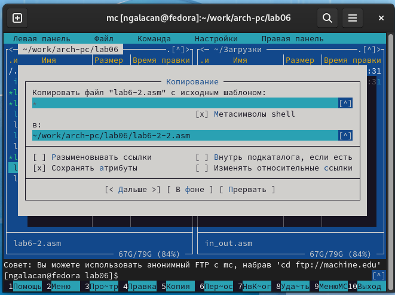

---
## Front matter
title: "Отчет по лабораторной работе №6"
subtitle: "*дисциплина: Архитектура компьютера*"
author: "Галацан Николай, НПИбд-01-22"

## Generic otions
lang: ru-RU
toc-title: "Содержание"

## Bibliography
bibliography: bib/cite.bib
csl: pandoc/csl/gost-r-7-0-5-2008-numeric.csl

## Pdf output format
toc: true # Table of contents
toc-depth: 2
lof: true # List of figures
fontsize: 12pt
linestretch: 1.5
papersize: a4
documentclass: scrreprt
## I18n polyglossia
polyglossia-lang:
  name: russian
  options:
	- spelling=modern
	- babelshorthands=true
polyglossia-otherlangs:
  name: english
## I18n babel
babel-lang: russian
babel-otherlangs: english
## Fonts
mainfont: PT Serif
romanfont: PT Serif
sansfont: PT Sans
monofont: PT Mono
mainfontoptions: Ligatures=TeX
romanfontoptions: Ligatures=TeX
sansfontoptions: Ligatures=TeX,Scale=MatchLowercase
monofontoptions: Scale=MatchLowercase,Scale=0.9
## Biblatex
biblatex: true
biblio-style: "gost-numeric"
biblatexoptions:
  - parentracker=true
  - backend=biber
  - hyperref=auto
  - language=auto
  - autolang=other*
  - citestyle=gost-numeric
## Pandoc-crossref LaTeX customization
figureTitle: "Рис."
tableTitle: "Таблица"
listingTitle: "Листинг"
lofTitle: "Список иллюстраций"
lolTitle: "Листинги"
## Misc options
indent: true
header-includes:
  - \usepackage{indentfirst}
  - \usepackage{float} # keep figures where there are in the text
  - \floatplacement{figure}{H} # keep figures where there are in the text
---

# Цель работы

Приобретение практических навыков работы в *Midnight Commander*. Освоение инструкций языка ассемблера `mov` и `int`.

# Выполнение лабораторной работы

Ввожу `mc`, чтобы открыть *Midnight Commander*. Пользуясь клавишами **вверх** , **вниз** и **Enter** перехожу в каталог, созданный при выполнении лабораторной работы №5. С помощью функцинальной клавиши **F7** создаю папку и перехожу в созданный каталог (рис. [-@fig:1]).

{ #fig:1 width=70% }

Пользуясь строкой ввода и командой touch создаю файл `lab6-1.asm` (рис. [-@fig:2]).

{ #fig:2 width=70% }

С помощью функциональной клавиши **F4** открываю файл для редактирования во встроенном редакторе (mcedit) и ввожу текст программы (рис. [-@fig:3]).

{ #fig:3 width=70% }

Нажимаю **F2** для сохранения изменений, **F10** - для выхода из редактора. С помощью **F3** открываю файл для просмотра и убеждаюсь, что текст программы сохранен (рис. [-@fig:4]).

{ #fig:4 width=70% }

Для скрытия и отображения панелей использую комбинацию клавиш **Ctrl+o**. Транслирую текст программы `lab6-1.asm` в объектный файл. Выполняю компоновку объектного файла и запускаю получившийся исполняемый файл. Программа выводит строку `'Введите строку:'` и ожидает ввода с клавиатуры. Ввожу ФИО (рис. [-@fig:5]).

{ #fig:5 width=70% }

Со страницы курса скачиваю файл `in_out.asm`. Во второй панели перехожу в папку "Загрузки". Копирую файл в рабочую папку с помощью **F5** (рис. [-@fig:6]).

{ #fig:6 width=70% }

С помощью функциональной клавиши **F6** создаю копию файла `lab6-1.asm` с именем `lab6-2.asm` (рис. [-@fig:7]).

{ #fig:7 width=70% }

Обнаруживаю, что файл был не скопирован, а только переименован, так как **F6** отвечает за перемещение файлов. Для того, чтобы сохранить исходный файл, создаю его копию с именем `lab6-1.asm` с помощью **F5** (рис. [-@fig:8]).

{ #fig:8 width=70% }

Исправляю текст программы в файле `lab6-2.asm` с использованием подпрограмм из внешнего файла `in_out.asm` в соответствии с листингом 6.2 (рис. [-@fig:9]). Создаю исполняемый файл и проверяю его работу (рис. [-@fig:10]).

{ #fig:9 width=70% }

{ #fig:10 width=70% }

Программы работают аналогично, но преимуществами второй являются удобство и читаемость.

В файле `lab6-2.asm` заменяю подпрограмму `sprintLF` на `sprint`. Создаю исполняемый файл и запускаю (рис. [-@fig:12]).

{ #fig:12 width=70% }

Разница в том, что после выведения приглашения ввести строку программа не производит перенос строки. За это отвечает `sprintLF`, которая была заменена.

# Выполнение заданий для самостоятельной работы

1. Создаю копию файла `lab6-1.asm` под новым именем `lab6-1-2.asm` (рис. [-@fig:13]).

{ #fig:13 width=70% }

Вношу изменения в программу, чтобы она работала по следующему алгоритму:

* вывести приглашение типа “Введите строку:”;
* ввести строку с клавиатуры;
* вывести введённую строку на экран.

Для этого перед завершением программы прописываю вывод введенной строки:
```
mov eax,4
mov ebx,1
mov ecx,buf1
mov edx,80
int 80h
```
Измененная программа `lab6-1-1.asm` выглядит следующим образом:
```
SECTION .data
msg: DB 'Введите строку:',10
msgLen: EQU $-msg

SECTION .bss
buf1: RESB 80

SECTION .text
GLOBAL _start
_start:
mov eax,4
mov ebx,1
mov ecx,msg
mov edx,msgLen
int 80h

mov eax, 3
mov ebx, 0
mov ecx, buf1
mov edx, 80
int 80h

mov eax,4
mov ebx,1
mov ecx,buf1
mov edx,80
int 80h

mov eax,1
mov ebx,0
int 80h
```

2. Создаю исполняемый файл и запускаю (рис. [-@fig:15]).

{ #fig:15 width=70% }

Программа запускается успешно и выводит ранее введенную строку.

3. Создаю копию файла `lab6-2.asm` под новым именем `lab6-2-2.asm` (рис. [-@fig:16]).

{ #fig:16 width=70% }

Вношу изменения в программу с использованием `in_out.asm`, чтобы она работала по следующему алгоритму:

* вывести приглашение типа “Введите строку:”;
* ввести строку с клавиатуры;
* вывести введённую строку на экран.

Для этого перед `call quit` прописываю вывод введенной строки:
```
mov eax,buf1
call sprintLF
```
Измененная программа `lab6-2-2.asm` выглядит следующим образом:
```
%include 'in_out.asm'

SECTION .data
msg: DB 'Введите строку: ',0h

SECTION .bss
buf1: RESB 80

SECTION .text
    GLOBAL _start
    _start:

    mov eax,msg
    call sprintLF

    mov ecx,buf1
    mov edx,80
    call sread

    mov eax,buf1
    call sprintLF

    call quit
```

4. Создаю исполняемый файл и запускаю (рис. [-@fig:18]).

{ #fig:18 width=70% }

Программа работает аналогично и выводит ранее введенную строку, а так же перенос строки, так как я использовал подпрограмму `sprintLF`.

# Выводы

На данной лабораторной работы были приобретены практические навыки работы в *Midnight Commander*. Изучена структура программы на языке ассемблера NASM, освоены инструкции языка ассемблера `mov` и `int`.

