---
## Front matter
title: "Отчет по лабораторной работе №7"
subtitle: "*дисциплина: Архитектура компьютера*"
author: "Галацан Николай, НПИбд-01-22"

## Generic otions
lang: ru-RU
toc-title: "Содержание"

## Bibliography
bibliography: bib/cite.bib
csl: pandoc/csl/gost-r-7-0-5-2008-numeric.csl

## Pdf output format
toc: true # Table of contents
toc-depth: 2
lof: true # List of figures
fontsize: 12pt
linestretch: 1.5
papersize: a4
documentclass: scrreprt
## I18n polyglossia
polyglossia-lang:
  name: russian
  options:
	- spelling=modern
	- babelshorthands=true
polyglossia-otherlangs:
  name: english
## I18n babel
babel-lang: russian
babel-otherlangs: english
## Fonts
mainfont: PT Serif
romanfont: PT Serif
sansfont: PT Sans
monofont: PT Mono
mainfontoptions: Ligatures=TeX
romanfontoptions: Ligatures=TeX
sansfontoptions: Ligatures=TeX,Scale=MatchLowercase
monofontoptions: Scale=MatchLowercase,Scale=0.9
## Biblatex
biblatex: true
biblio-style: "gost-numeric"
biblatexoptions:
  - parentracker=true
  - backend=biber
  - hyperref=auto
  - language=auto
  - autolang=other*
  - citestyle=gost-numeric
## Pandoc-crossref LaTeX customization
figureTitle: "Рис."
tableTitle: "Таблица"
listingTitle: "Листинг"
lofTitle: "Список иллюстраций"
lolTitle: "Листинги"
## Misc options
indent: true
header-includes:
  - \usepackage{indentfirst}
  - \usepackage{float} # keep figures where there are in the text
  - \floatplacement{figure}{H} # keep figures where there are in the text
---

# Цель работы

Освоение арифметических инструкций языка ассемблера NASM.

# Выполнение лабораторной работы

1. Ввожу команды для создания каталога лабораторной работы, перехожу в него, создаю файл `lab7-1.asm` и проверяю его наличие (рис. [-@fig:1]).

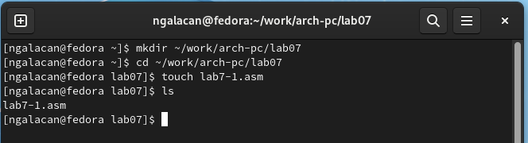{ #fig:1 width=70% }

2. С помощью функциональной клавиши **F4** открываю файл для редактирования, ввожу в файл `lab7-1.asm` текст программы из листинга 7.1, сохраняю файл и открываю для просмотра с помощью **F3** (рис. [-@fig:2]).

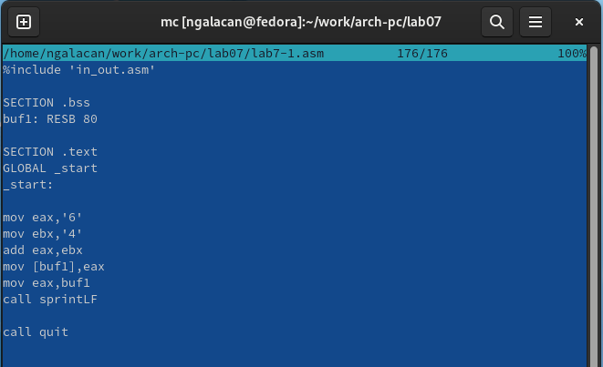{ #fig:2 width=70% }

Создаю исполняемый файл и запускаю его, предварительно скопировав файл `in_out.asm` в соответствующий каталог (рис. [-@fig:3]).

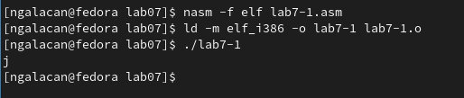{ #fig:3 width=70% }

В результате исполнения программы выводится символ *j*.

3. Далее изменяю текст программы и вместо символов записываю в регистры числа, заменив строки
```
mov eax,'6'
mov ebx,'4'
```
на
```
mov eax,6
mov ebx,4
```

Создаю исполняемый файл и запускаю его (рис. [-@fig:4]).

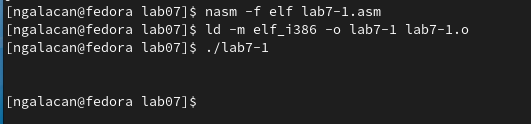{ #fig:4 width=70% }

В результате исполнения программы выводится символ с кодом 10. По таблице ASCII этот код соответствует символу перевода строки (`LF, \n`). Сам символ не отображается, но перевод строки был осуществлен.

4. Создаю файл `lab7-2.asm` в том же каталоге, введя `touch ~/work/arch-pc/lab07/lab7-2.asm` и ввожу в него текст программы из листинга 7.2, сохраняю и открываю файл для просмотра (рис. [-@fig:5]).

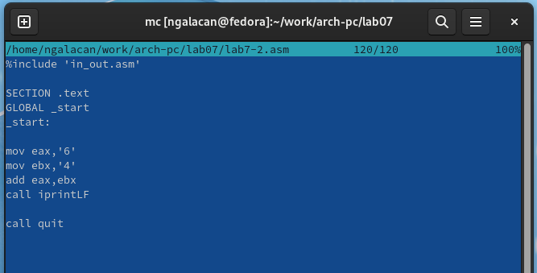{ #fig:5 width=70% }

Создаю исполняемый файл и запускаю его (рис. [-@fig:6]).

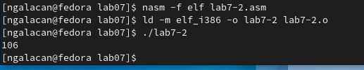{ #fig:6 width=70% }

В результате работы программы выводится число 106, то есть код символа *j* благодаря функции `iprintLF`.

5. Снова изменяю текст программы и вместо символов записываю в регистры числа, заменив строки
```
mov eax,'6'
mov ebx,'4'
```
на
```
mov eax,6
mov ebx,4
```

Создаю исполняемый файл и запускаю его 

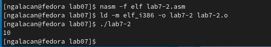{ #fig:7 width=70% }

В результате работы программы выводится число 10, что и требовалось получить изначально.

Заменяю функцию `iprintLF` на `iprint`. Создаю исполняемый файл и запускаю его (рис. [-@fig:8]).

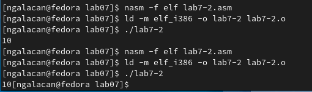{ #fig:8 width=70% }

Вывод функции `iprintLF` отличается от `iprint` тем, что в первом случае выводится перевод строки после выведения результата, а во втором нет (аналогично работают `sprintLF` и `sprint`).

6. Создаю файл `lab7-3.asm`, введя `touch ~/work/arch-pc/lab07/lab7-3.asm`. Изучив текст программы из листинга 7.3, ввожу его в созданный файл, сохраняю и открываю для просмотра (рис. [-@fig:9]).

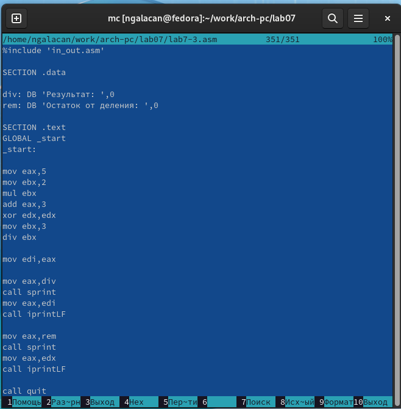{ #fig:9 width=70% }

Создаю исполняемый файл и запускаю его (рис. [-@fig:10]).

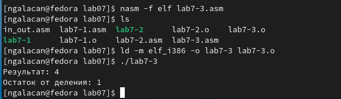{ #fig:10 width=70% }

Программа вычисляет значение выражения `(5*2+3)/3`, выводит результат и остаток от деления.

Изменяю текст программы для вычисления выражения `(4*6+2)/5` (рис. [-@fig:11]). Создаю исполняемый файл и запускаю (рис. [-@fig:12]).

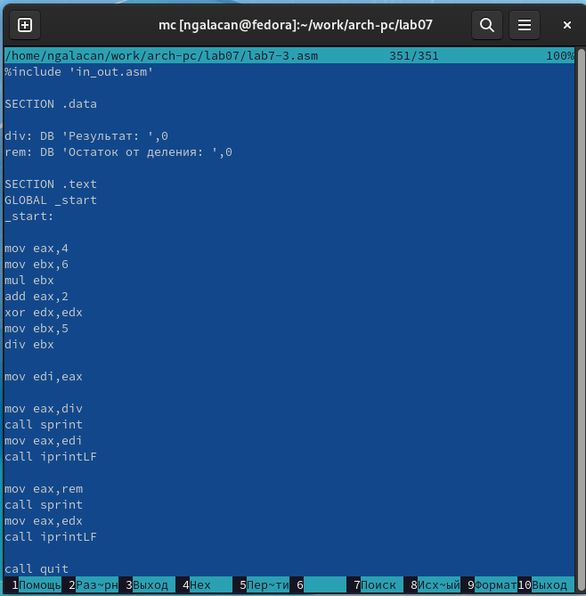{ #fig:11 width=70% }

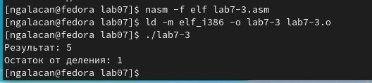{ #fig:12 width=70% }

В результате работы программа выводит верный ответ и остаток от деления.

7. Создаю файл `variant.asm`, введя `touch ~/work/arch-pc/lab07/variant.asm`. Ввожу в него текст программы из листинга 7.4, предварительно изучив его (рис. [-@fig:13]).

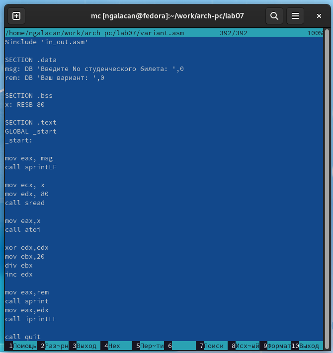{ #fig:13 width=70% }

Создаю исполняемый файл и запускаю (рис. [-@fig:14]).

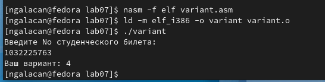{ #fig:14 width=70% }

В результате работы программа выводит номер моего варианта (**4**) , который совпадает с вычисленным аналитически.

**Ответы на вопросы:**

1. *Какие строки листинга 7.4 отвечают за вывод на экран сообщения ‘Ваш вариант:’?*

```
mov eax,rem
call sprint
```

2. *Для чего используется следующие инструкции nasm?*

```
mov ecx, x 
mov edx, 80 
call sread
```

Для считывания переменной х, необходимой для вычисления варианта.

3. *Для чего используется инструкция “`call atoi`”?*

Инструкция используется для преобразования символа, введенного с клавиатуры, в число для корректного вычисления выражения.

4. *Какие строки листинга 7.4 отвечают за вычисления варианта?*

```
xor edx,edx
mov ebx,20
div ebx
inc edx
```

5. *В какой регистр записывается остаток от деления при выполнении инструкции “`div ebx`”?*

В регистр edx.

6. *Для чего используется инструкция “`inc edx`”?*

Для прибавления 1 к операнду (edx).

7. *Какие строки листинга 7.4 отвечают за вывод на экран результата вычислений?*

```
mov eax,edx
call iprintLF
```

# Выполнение заданий для самостоятельной работы

В соответствии с полученным вариантом (**4**), мне необходимо написать программу для вычисления выражения *f(x)=4/3(x-1)+5*. Программа должна выводить выражение для вычисления, выводить запрос на ввод значения *х*, вычислять заданное выражение в зависимости от введенного *х*, выводить результат вычислений.

Создаю файл `lab7-sam.asm` и набираю текст программы. Написанная программа имеет следующий вид:

```
%include 'in_out.asm'

SECTION .data
variant: DB 'Вариант 4. Выражение: 4/3(x-1)+5.',0
vvod: DB 'Введите x: ',0
rez: DB 'Результат: ',0

SECTION .bss
x: RESB 80

SECTION .text
GLOBAL _start
_start:

mov eax, variant
call sprintLF

mov eax, vvod
call sprintLF

mov ecx, x
mov edx, 80
call sread

mov eax, x
call atoi

dec eax  ; x-1

mov ebx, 4 ; (x-1)*4
mul ebx

xor edx,edx ;(x-1)*4/3
mov ebx, 3
div ebx

add eax, 5 ;(x-1)*4/3+5

mov edi,eax

mov eax, rez
call sprint
mov eax, edi
call iprintLF

call quit
```

Создаю исполняемый файл и запускаю, ввожу значения *х*, заданные в таблице 7.3 (рис. [-@fig:17]).

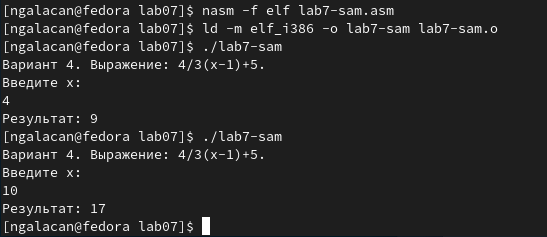{ #fig:17 width=70% }

Программа работает в соответствии с заданием: выводит выражение, запрашивает *х*, вычисляет выражение и выводит верный результат.

# Выводы

На данной лабораторной работе были освоены арифметические инструкции языка ассемблера NASM и их особенности.

