---
## Front matter
title: "Отчет по лабораторной работе №8"
subtitle: "*дисциплина: Архитектура компьютера*"
author: "Галацан Николай, НПИбд-01-22"

## Generic otions
lang: ru-RU
toc-title: "Содержание"

## Bibliography
bibliography: bib/cite.bib
csl: pandoc/csl/gost-r-7-0-5-2008-numeric.csl

## Pdf output format
toc: true # Table of contents
toc-depth: 2
lof: true # List of figures
fontsize: 12pt
linestretch: 1.5
papersize: a4
documentclass: scrreprt
## I18n polyglossia
polyglossia-lang:
  name: russian
  options:
	- spelling=modern
	- babelshorthands=true
polyglossia-otherlangs:
  name: english
## I18n babel
babel-lang: russian
babel-otherlangs: english
## Fonts
mainfont: PT Serif
romanfont: PT Serif
sansfont: PT Sans
monofont: PT Mono
mainfontoptions: Ligatures=TeX
romanfontoptions: Ligatures=TeX
sansfontoptions: Ligatures=TeX,Scale=MatchLowercase
monofontoptions: Scale=MatchLowercase,Scale=0.9
## Biblatex
biblatex: true
biblio-style: "gost-numeric"
biblatexoptions:
  - parentracker=true
  - backend=biber
  - hyperref=auto
  - language=auto
  - autolang=other*
  - citestyle=gost-numeric
## Pandoc-crossref LaTeX customization
figureTitle: "Рис."
tableTitle: "Таблица"
listingTitle: "Листинг"
lofTitle: "Список иллюстраций"
lolTitle: "Листинги"
## Misc options
indent: true
header-includes:
  - \usepackage{indentfirst}
  - \usepackage{float} # keep figures where there are in the text
  - \floatplacement{figure}{H} # keep figures where there are in the text
---

# Цель работы

Изучение команд условного и безусловного переходов. Приобретение навыков написания программ с использованием переходов. Знакомство с назначением и структурой файла листинга.

# Выполнение лабораторной работы

1. Ввожу команды для создания каталога лабораторной работы, перехожу в него, создаю файл `lab8-1.asm` 
```
mkdir ~/work/arch-pc/lab08
cd ~/work/arch-pc/lab08
touch lab8-1.asm
```
2. Ввожу в файл `lab8-1.asm` текст программы из листинга 8.1, сохраняю файл. (рис. [-@fig:1]).

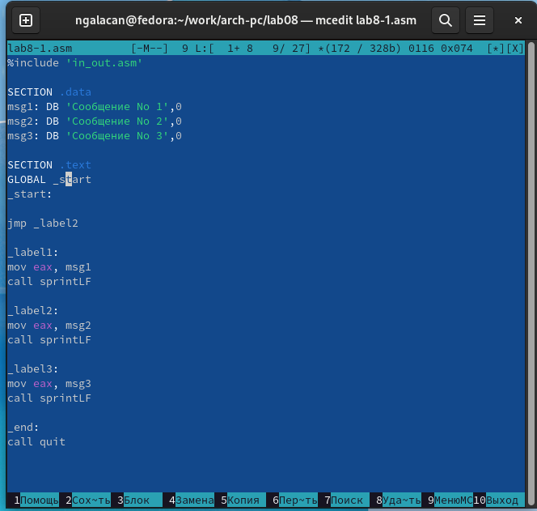{ #fig:1 width=70% }

Создаю исполняемый файл и запускаю его, предварительно скопировав файл `in_out.asm` в соответствующий каталог (рис. [-@fig:2]).

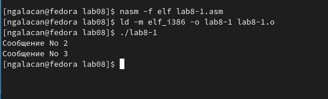{ #fig:2 width=70% }

Результат исполнения программы соответствует результату из инструкции.

Далее изменяю текст программы в соответствии с листингом 8.2 (рис. [-@fig:3]).

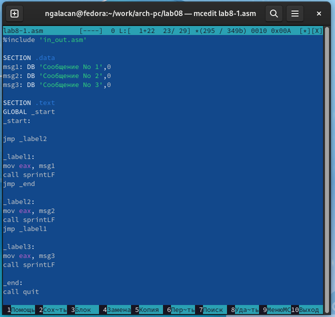{ #fig:3 width=70% }

Создаю исполняемый файл и запускаю его (рис. [-@fig:4]).

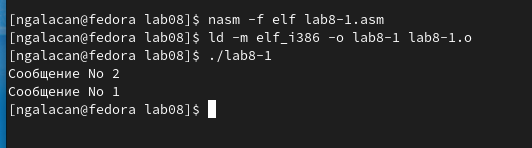{ #fig:4 width=70% }

В результате исполнения программы выводится сначала "Сообщение №2", а после "Сообщение №1", так как был применен безусловный переход.

Изменяю текст программы, чтобы сообщения выводились в обратном порядке (от третьего к первому) рис. [-@fig:5]).

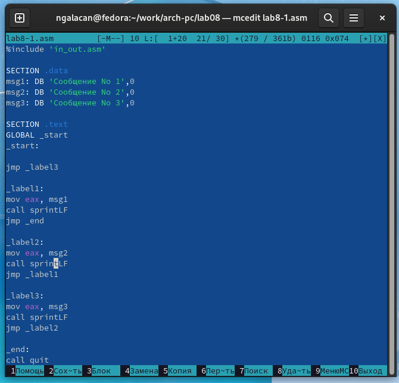{ #fig:5 width=70% }

Создаю исполняемый файл и запускаю его (рис. [-@fig:6]).

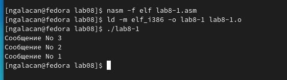{ #fig:6 width=70% }

В результате работы программа выводит сообщения в нужном порядке.


3. Создаю новый файл: `touch lab8-2.asm`. Ввожу в него текст программы из листинга 8.3, внимательно изучив (рис. [-@fig:7]).

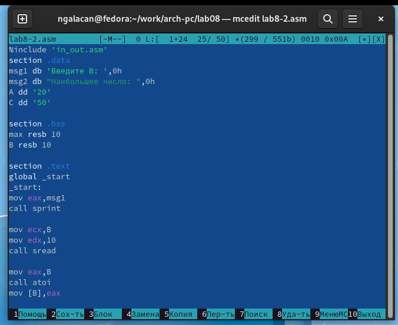{ #fig:7 width=70% }

Создаю исполняемый файл и запускаю его. Проверяю работу программы для разных значений *В*. (рис. [-@fig:9]).

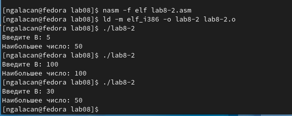{ #fig:9 width=70% }

4. Ввожу команду для получения файла листинга и открываю его в `mcedit`(рис. [-@fig:10], рис. [-@fig:11]).

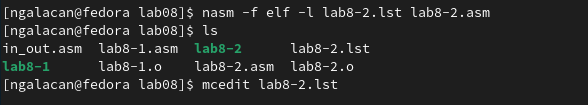{ #fig:10 width=70% }

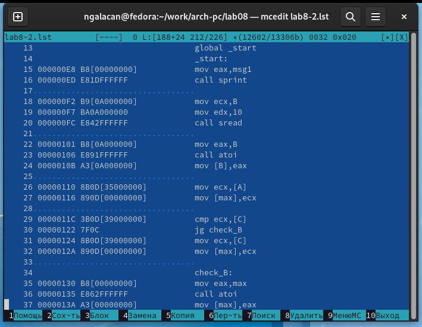{ #fig:11 width=70% }

Строки 
```
mov ecx,B
mov edx,10
call sread
```
отвечают за считывание переменной *В*. Файл листинга, кроме исходного текста программы, содержит дополнительную информацию:

* в первом столбце указаны номера строк
* во втором столбце указан адрес - смещение машинного кода от начала текущего сегмента
* в третьем столбце - машинный код в шестнадцатеричном представлении, который ассемблируется из исходных строк

Например, инструкция `mov ecx,B` ассемблируется в машинный код `B9[0A000000]`, а адресом является `000000F2`, и все это находится на строке 18. Инструкция `mov edx,10` ассемблируется в машинный код `BA0A000000`, а адресом является `000000F7`, находится на строке 19. Инструкция `call sread` ассемблируется в машинный код `E842FFFFFF`, а адресом является `000000FC`, находится на строке 20.

Открываю файл с программой `lab8-2.asm` и в инструкции `mov eax, msg1` удаляю один операнд (рис. [-@fig:12]).

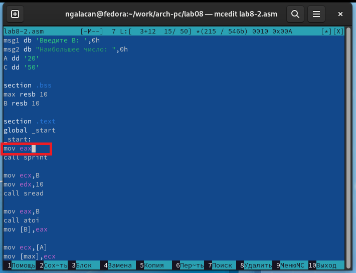{ #fig:12 width=70% }

Выполняю трансляцию с получением файла листинга (рис. [-@fig:13]).

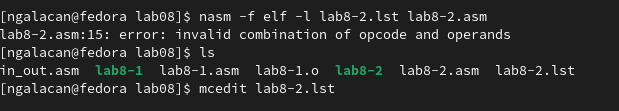{ #fig:13 width=70% }

Транслятор указывает на ошибку. Не создается объектный файл. Проверяю наличие файла листинга и открываю его (рис. [-@fig:14]).

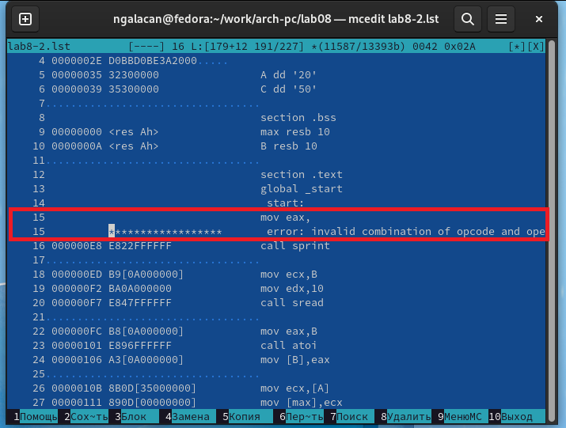{ #fig:14 width=70% }

В листинге добавляется строка с указанием ошибки под строкой, в которой был удален операнд. Раздел с машинным кодом заполнен "*", адрес пуст.

# Выполнение заданий для самостоятельной работы

В ЛР №7 был получен 4-ый вариант заданий.

1. Необходимо написать программу для нахождения наименьшей из 3 целочисленных переменных. Значения переменных выбраны из табл. 8.5 в соответствии с вариантом, и равны 8, 88, 68 соответственно.

Создаю файл `lab8-sam-1.asm` и набираю текст программы. Написанная программа имеет следующий вид:

```
%include 'in_out.asm'
section .data
res db 'Наибольшее число:  ',0h
A dd '8'
B dd '88'
C dd '68'

section .bss
max resb 10

section .text
global _start
_start:

mov ecx,[A] ;запись А в max
mov [max],ecx

cmp ecx,[B] ;сравнение А и В
jg check_C ;если А>B
mov ecx,[B] ;иначе
mov [max],ecx

check_C:
cmp ecx,[C] ;сравнение большего из А и В с С
jg fin ;если max>С
mov ecx,[C]
mov [max],ecx

fin:
mov eax, res
call sprint

mov eax,max
call atoi ;преобразование символа в число
mov [max],eax

mov eax,[max]
call iprintLF
call quit
```

Создаю исполняемый файл и запускаю, программа выводит верное наибольшее число (рис. [-@fig:15]).

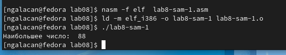{ #fig:15 width=70% }

2. Необходимо написать программу, которая вычисляет значение функции в соответствии с введенными *х* и *а* и выводит результат. Вид функции выбран из табл. 8.6 согласно варианту. 

Создаю файл `lab8-sam-2.asm` и набираю текст программы. Для вычисления значения функции в зависимости от *а* использую условный переход `je`, переход совершается при выполнении равенства операндов инструкции `cmp`. Также использую команду безусловного перехода `jmp`. Написанная программа имеет следующий вид:
```
%include 'in_out.asm'
section .data
var  db 'Вариант 4.',0h
msgx db 'Введите x: ',0h
msga db 'Введите a: ',0h
res db 'Результат: ',0h 

section .bss
x resb 10
a resb 10
r resb 10

section .text
global _start
_start:
mov eax,var
call sprintLF

mov eax,msgx
call sprint

mov ecx,x
mov edx,10
call sread

mov eax, x
call atoi
mov [x],eax

mov eax,msga
call sprint

mov ecx,a
mov edx,10
call sread

mov eax, a
call atoi
mov [a],eax

mov edx,0
cmp edx,[a]
je label1
mov eax,[x]
mov ebx,2
mul ebx
add eax, [a]
mov [r],eax
jmp fin

label1:
mov eax,[x]
mov ebx,2
mul ebx ; 2*x
inc eax ; 2*x+1
mov [r],eax

fin:
mov eax, res
call sprint
mov eax,[r]
call iprintLF
call quit
```

Создаю исполняемый файл и запускаю. Проверяю результат для разных *х* и *а*, взятых из табл. 8.6 (рис. [-@fig:16]).

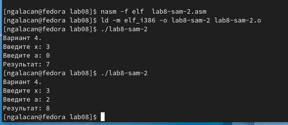{ #fig:16 width=70% }

Программа вычисляет верные значения функции.

# Выводы

В ходе лабораторной работы изучены команды условного и безусловного переходов. Приобретены навыки написания программ с использованием переходов. Изучено назначение и структура файла листинга.
