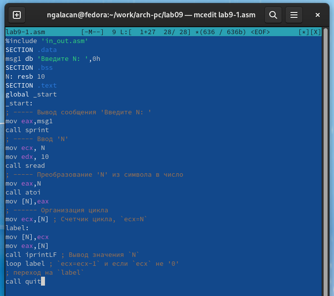
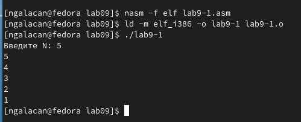
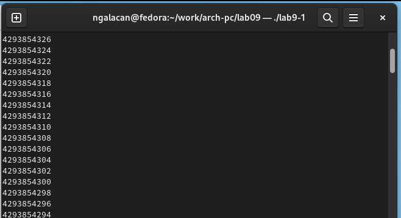
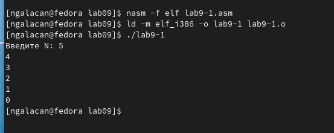
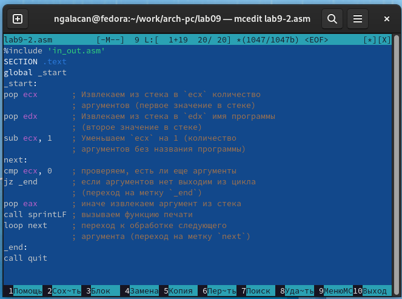
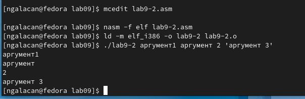
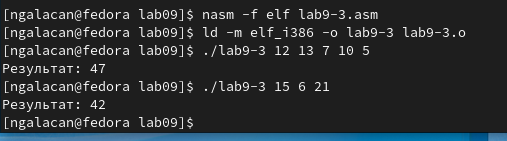
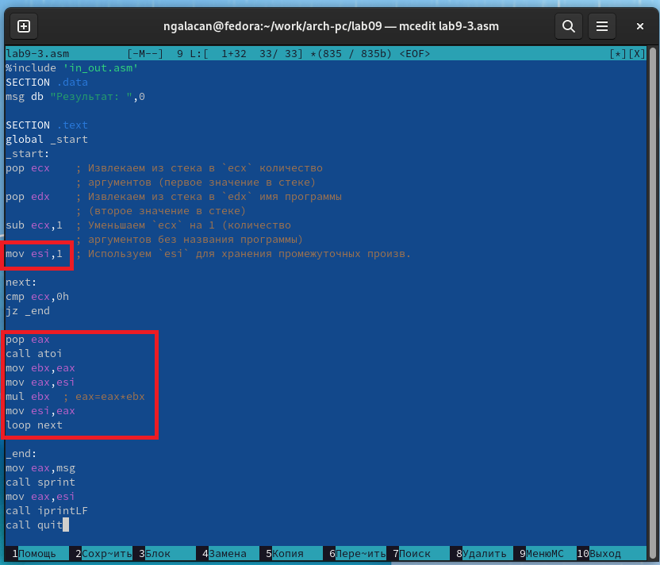
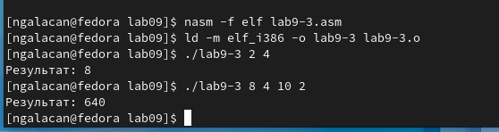
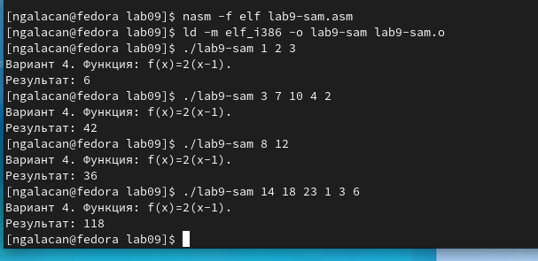

---
## Front matter
title: "Отчет по лабораторной работе №9"
subtitle: "*дисциплина: Архитектура компьютера*"
author: "Галацан Николай, НПИбд-01-22"

## Generic otions
lang: ru-RU
toc-title: "Содержание"

## Bibliography
bibliography: bib/cite.bib
csl: pandoc/csl/gost-r-7-0-5-2008-numeric.csl

## Pdf output format
toc: true # Table of contents
toc-depth: 2
lof: true # List of figures
fontsize: 12pt
linestretch: 1.5
papersize: a4
documentclass: scrreprt
## I18n polyglossia
polyglossia-lang:
  name: russian
  options:
	- spelling=modern
	- babelshorthands=true
polyglossia-otherlangs:
  name: english
## I18n babel
babel-lang: russian
babel-otherlangs: english
## Fonts
mainfont: PT Serif
romanfont: PT Serif
sansfont: PT Sans
monofont: PT Mono
mainfontoptions: Ligatures=TeX
romanfontoptions: Ligatures=TeX
sansfontoptions: Ligatures=TeX,Scale=MatchLowercase
monofontoptions: Scale=MatchLowercase,Scale=0.9
## Biblatex
biblatex: true
biblio-style: "gost-numeric"
biblatexoptions:
  - parentracker=true
  - backend=biber
  - hyperref=auto
  - language=auto
  - autolang=other*
  - citestyle=gost-numeric
## Pandoc-crossref LaTeX customization
figureTitle: "Рис."
tableTitle: "Таблица"
listingTitle: "Листинг"
lofTitle: "Список иллюстраций"
lolTitle: "Листинги"
## Misc options
indent: true
header-includes:
  - \usepackage{indentfirst}
  - \usepackage{float} # keep figures where there are in the text
  - \floatplacement{figure}{H} # keep figures where there are in the text
---

# Цель работы

Приобретение навыков написания программ с использованием циклов и обработкой аргументов командной строки.

# Выполнение лабораторной работы

Ввожу команды для создания каталога лабораторной работы, перехожу в него, создаю файл `lab9-1.asm` 
```
mkdir ~/work/arch-pc/lab09
cd ~/work/arch-pc/lab09
touch lab9-1.asm
```
Ввожу в файл `lab9-1.asm` текст программы из листинга 9.1, сохраняю файл. (рис. [-@fig:1]).

{ #fig:1 width=70% }

Создаю исполняемый файл и запускаю его (рис. [-@fig:2]).

{ #fig:2 width=70% }

В результате выводится верное количество проходов по циклу.

Редактирую текст программы, добавив изменение значения регистра `eax` в цикле:
```
label:
sub ecx,1 ; `ecx=ecx-1`
mov [N],ecx
mov eax,[N]
call iprintLF
loop label
```
Создаю исполняемый файл и запускаю его (рис. [-@fig:3]).

{ #fig:3 width=70% }

В результате исполнения программа зацикливается. Число проходов цикла не соответствует значению, введенному с клавиатуры. Программа работает некорректно.

Редактирую текст программы, чтобы можно было использовать регистр `ecx` в цикле с помощью стека:
```
label:
push ecx 
sub ecx,1
mov [N],ecx
mov eax,[N]
call iprintLF
pop ecx 
loop label
```

Создаю исполняемый файл и запускаю его (рис. [-@fig:4]).

{ #fig:4 width=70% }

Число проходов цикла соответствует значению, введенному с клавиатуры.

Создаю новый файл: `touch lab9-2.asm`. Ввожу в него текст программы из листинга 9.2, внимательно изучив (рис. [-@fig:5]).

{ #fig:5 width=70% }

Создаю исполняемый файл и запускаю его (рис. [-@fig:6]).

{ #fig:6 width=70% }

Программой обработано 4 аргумента (аргументы отделяются друг от друга пробелом, из-за чего `аргумент` и `2` программа восприняла отдельно).

Создаю новый файл: `touch lab9-3.asm`. Ввожу в него текст программы из листинга 9.3. Создаю исполняемый файл и запускаю его, указав разные аргументы (рис. [-@fig:7]).

{ #fig:7 width=70% }

Редактирую текст программы `lab9-3.asm` для вычисления произведения аргументов командной строки (рис. [-@fig:8]).

{ #fig:8 width=70% }

Значение `esi` меняю на 1 для корректного умножения. Аргумент из командной строки переносится в `ebx`, в `eax` помещается значение регистра `esi`. Выполняется умножение, и результат умножения переносится из `eax` в `esi`.

Создаю исполняемый файл и запускаю его, вводя разные аргументы (рис. [-@fig:9]).

{ #fig:9 width=70% }

Программа вычисляет верное произведение аргументов командной строки.

# Выполнение заданий для самостоятельной работы

В лабораторной работе №7 был получен 4-ый вариант заданий.

1. Необходимо написать программу для нахождения суммы значений функции, где значения *x* передаются как аргументы. В соответствии вариантом выбрана функция *f(x)=2(x-1)*.

Создаю файл `lab9-sam.asm` и набираю текст программы. Написанная программа имеет следующий вид:

```
%include 'in_out.asm'
SECTION .data
msg db "Результат: ",0
fn db "Вариант 4. Функция: f(x)=2(x-1)."
SECTION .text
global _start
_start:
pop ecx    ; Извлекаем из стека в `ecx` количество
           ; аргументов (первое значение в стеке)
pop edx    ; Извлекаем из стека в `edx` имя программы
           ; (второе значение в стеке)
sub ecx,1  ; Уменьшаем `ecx` на 1 (количество
           ; аргументов без названия программы
mov esi,0  ; Используем `esi` для хранения промежуточных результатов

next:
cmp ecx,0h
jz _end

pop eax ; eax=x
call atoi
sub eax,1 ; eax=x-1
mov ebx,2
mul ebx  ; eax=(x-1)*2
add esi,eax ; esi=esi+eax
loop next

_end:
mov eax,fn
call sprintLF
mov eax,msg
call sprint
mov eax,esi
call iprintLF
call quit
```

Создаю исполняемый файл и запускаю, проверяю работу на нескольких наборах *x* (рис. [-@fig:10]):

* 1 2 3
* 3 7 10 4 2
* 8 12
* 14 18 23 1 3 6

{ #fig:10 width=70% }

Вычисляю аналитически сумму значений функции при каждом наборе. Программа выводит верный результат.

# Выводы

Были приобретены навыки программирования циклов. Изучена и применена обработка аргументов командной строки.
