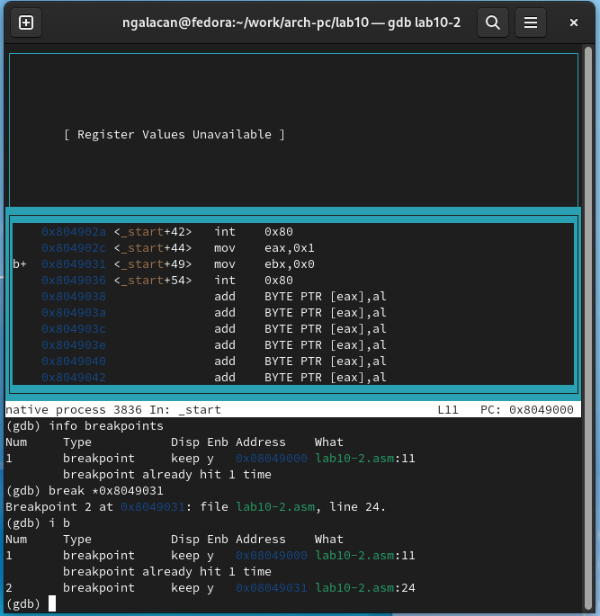

---
## Front matter
title: "Отчет по лабораторной работе №10"
subtitle: "*дисциплина: Архитектура компьютера*"
author: "Галацан Николай, НПИбд-01-22"

## Generic otions
lang: ru-RU
toc-title: "Содержание"

## Bibliography
bibliography: bib/cite.bib
csl: pandoc/csl/gost-r-7-0-5-2008-numeric.csl

## Pdf output format
toc: true # Table of contents
toc-depth: 2
lof: true # List of figures
fontsize: 12pt
linestretch: 1.5
papersize: a4
documentclass: scrreprt
## I18n polyglossia
polyglossia-lang:
  name: russian
  options:
	- spelling=modern
	- babelshorthands=true
polyglossia-otherlangs:
  name: english
## I18n babel
babel-lang: russian
babel-otherlangs: english
## Fonts
mainfont: PT Serif
romanfont: PT Serif
sansfont: PT Sans
monofont: PT Mono
mainfontoptions: Ligatures=TeX
romanfontoptions: Ligatures=TeX
sansfontoptions: Ligatures=TeX,Scale=MatchLowercase
monofontoptions: Scale=MatchLowercase,Scale=0.9
## Biblatex
biblatex: true
biblio-style: "gost-numeric"
biblatexoptions:
  - parentracker=true
  - backend=biber
  - hyperref=auto
  - language=auto
  - autolang=other*
  - citestyle=gost-numeric
## Pandoc-crossref LaTeX customization
figureTitle: "Рис."
tableTitle: "Таблица"
listingTitle: "Листинг"
lofTitle: "Список иллюстраций"
lolTitle: "Листинги"
## Misc options
indent: true
header-includes:
  - \usepackage{indentfirst}
  - \usepackage{float} # keep figures where there are in the text
  - \floatplacement{figure}{H} # keep figures where there are in the text
---

# Цель работы

Приобретение навыков написания программ с использованием подпрограмм. Знакомство с методами отладки при помощи GDB и его основными возможностями.

# Выполнение лабораторной работы

1. Ввожу команды для создания каталога лабораторной работы, перехожу в него, создаю файл `lab10-1.asm` 
```
mkdir ~/work/arch-pc/lab10
cd ~/work/arch-pc/lab10
touch lab10-1.asm
```
2. Ввожу в файл `lab10-1.asm` текст программы из листинга 10.1, сохраняю файл. (рис. [-@fig:1]).

{ #fig:1 width=70% }

Создаю исполняемый файл и запускаю его, предварительно скопировав файл `in_out.asm` в соответствующий каталог. Выводится сообщение об ошибке. Исправляю опечатки в имени переменной и вновь запускаю программу. Программа работает верно (рис. [-@fig:2]).

{ #fig:2 width=70% }

Далее изменяю текст программы добавив подпрограмму `_subcalcul` в  `_calcul` для вычисления выражения *f(g(x))*, где *х* вводится с клавиатуры. (рис. [-@fig:3]).

{ #fig:3 width=70% }

Создаю исполняемый файл и запускаю его (рис. [-@fig:4]).

{ #fig:4 width=70% }

Убеждаюсь в том, что программа вычисляет верное значение.

Создаю новый файл: `touch lab10-2.asm`. Ввожу в него текст программы из листинга 10.2 (рис. [-@fig:5]).

{ #fig:5 width=70% }

Создаю исполняемый файл, с которым можно работать в GDB и загружаю в отладчик:
```
nasm -f elf -g -l lab10-2.lst lab10-2.asm
ld -m elf_i386 -o lab10-2 lab10-2.o
gdb lab10-2
```
Запускаю программу в отладчике (рис. [-@fig:6]).

{ #fig:6 width=70% }

Устанавливаю брейкпоинт на метку `_start` и запускаю программу (рис. [-@fig:7]).

{ #fig:7 width=70% }

Просматриваю дисассимилированный код программы начиная с `_start`. Переключаюсь на отображение команд с синтаксисом Intel (рис. [-@fig:8]).

{ #fig:8 width=70% }

Различия отображения синтаксиса машинных команд в режимах ATT и Intel заключаются в том, что в режиме Intel регистры и их значения отображаются более привычно и визуально удобно (колонка справа). Сначала указано название регистра, через запятую - его значение. В режиме ATT наоборот: сначала $значение, после - %регистр.

Включаю режим псевографики (рис. [-@fig:9]).
```
layout asm
layout regs
```

{ #fig:9 width=70% }

Проверяю наличие установленной точки останова. Устанавливаю еще одну по адресу инструкции, вновь запрашиваю информацию краткой командой (рис. [-@fig:10])

{ #fig:10 width=70% }

Выполнняю 5 инструкций `stepi` (рис. [-@fig:11]).

{ #fig:11 width=70% }

Поочередно меняются значения регистров `eax`, `ebx`, `ecx`, `edx` и снова `eax`. Изменения соответствуют исходному коду программы.

Просматриваю содержимое регистров, введя `info registers` (рис. [-@fig:12]).

{ #fig:12 width=70% }

Просматриваю значение переменной `msg1` по имени, `msg2` - по адресу из дизассемблированной инструкции (рис. [-@fig:13]).

{ #fig:13 width=70% }

Изменяю первый символ переменной `msg1`, символ в переменной `msg2` с помощью команды `set` (рис. [-@fig:14]).

{ #fig:14 width=70% }

Вывожу значение регистра `edx` в шестнадцатеричном формате (`p/x $edx`), в двоичном формате (`p/t $edx`), в символьном формате (`p/s $edx`) (рис. [-@fig:15]).

{ #fig:15 width=70% }

С помощью команды `set` меняю значение регистра `ebx`, вывожу значение с помощью `p/s` (рис. [-@fig:16]).

{ #fig:16 width=70% }

В первом случае был введен символ '2' и в качестве значения регистра был выведен номер символа в таблице ASCII (символ 2 имеет номер 50). Во втором случае было введено и выведено само число 2.

Завершаю выполнение программы с помощью команды `continue` и выхожу из GDB с помощью команды `quit`.

Копирую файл `lab9-2.asm` с именем `lab10-3.asm` в соответствующий ЛР каталог. Создаю исполняемый файл, загружаю программу с аргументами в командной строке в отладчик, указав ключ `--args` (рис. [-@fig:17]).

{ #fig:17 width=70% }

Устанавливаю точку останова перед первой инструкцией в программе, запускаю. Программа останавливается на брейкпоинте. Вывожу число аргументов (включая имя программы), которые хранятся в `esp` (рис. [-@fig:18]).

{ #fig:18 width=70% }

Просматриваю остальные позиции стека с шагом измерения адреса 4 (рис. [-@fig:19]).

{ #fig:19 width=70% }

Шаг измерения адреса равен 4, так как при добавлении в стек соответствующее значение помещается в ячейку памяти, на которую указывает регистр `esp`, после чего значение регистра увеличивается на 4 (т.е. "4" означает размер - 4 байта, что соответствует 32 битам). 

# Выполнение заданий для самостоятельной работы

1. Копирую файл `lab9-sam.asm` с именем `lab10-sam-1.asm` в соответствующий ЛР каталог. Редактирую программу, реализовав вычисление функции *f(x)=2(x-1)* в виде подпрограммы `_function`. Преобразованная программа:
```
%include 'in_out.asm'
SECTION .data
msg db "Результат: ",0
fn db "Вариант 4. Функция: f(x)=2(x-1)."
SECTION .text
global _start
_start:
pop ecx    ; Извлекаем из стека в `ecx` количество
           ; аргументов (первое значение в стеке)
pop edx    ; Извлекаем из стека в `edx` имя программы
           ; (второе значение в стеке)
sub ecx,1  ; Уменьшаем `ecx` на 1 (количество
           ; аргументов без названия программы
mov esi,0  ; Используем `esi` для хранения промежуточных результатов

next:
cmp ecx,0h
jz _end

pop eax ; eax=x
call atoi
call _function
add esi,eax
loop next

_end:
mov eax,fn
call sprintLF
mov eax,msg
call sprint
mov eax,esi
call iprintLF
call quit

_function:
sub eax,1 ; eax=x-1
mov ebx,2
mul ebx  ; eax=(x-1)*2
ret

```
Внутри цикла после проверки условия извлекается значение из стека, которое преобразуется в целое число. После этого вызывается функция с помощью `call`. Вычисляется значение функции, которое остается в `eax` и передается управление программе в том же месте, где был осуществлен вызов функции. 
 
Создаю исполняемый файл и запускаю, введя такие же наборы *х*, как в ЛР №9. Убеждаюсь, что результат совпадает. Следовательно преобразованная программа работает правильно (рис. [-@fig:20]).

{ #fig:20 width=70% }

2. Создаю файл `lab10-sam-2.asm` и ввожу в него программу из листинга 10.3. Создаю исполняемый файл, запускаю. Программа выводит неверный результат (рис. [-@fig:21]).

{ #fig:21 width=70% }

Создаю исполняемый файл, оттранслировав с ключом `-g` для работы в GDB и загружаю в отладчик (рис. [-@fig:22]).

{ #fig:22 width=70% }

Просматриваю дисассимилированный код программы в синтаксисе Intel. Включаю режим псевдографики. Проставляю брейкпоинт на метку `_start` и запрашиваю информацию о брейкпоинтах. Запускаю программу, ввожу `si` для выполнения следующего шага. В регистр `ebx` помещается сумма значений `ebx` (3) и `eax` (2). Значение `ebx`=5. (рис. [-@fig:24]).

{ #fig:24 width=70% }

Выполняю следующие шаги. В `ecx` помещается 4, выполняется умножение. Результат умножения сохраняется в `eax` (т.е. 2*4=8) (рис. [-@fig:25]).

{ #fig:25 width=70% }

После этого к регистру `ebx` прибавляется 5, регистр принимает значение 10. Это значение помещается в `edi` в качестве результата. То есть, произведение, которое сохранилось в `eax` при вычислении выражение учтено не было, из-за чего выводится неверный результат (рис. [-@fig:27]).

{ #fig:27 width=70% }

Выхожу из отладчика и вношу изменения в текст программы, чтобы промежуточные результаты сохранялись в регистре `eax`. Измененная программа:
```
%include 'in_out.asm'
SECTION .data
div: DB 'Результат: ',0

SECTION .text
GLOBAL _start
_start:
; ---- Вычисление выражения (3+2)*4+5
mov ebx,3
mov eax,2
add eax,ebx
mov ecx,4
mul ecx
add eax,5
mov edi,eax
; ---- Вывод результата на экран
mov eax,div
call sprint
mov eax,edi
call iprintLF

call quit
```
Аналогично, как описано выше, загружаю программу в отладчик и пошагово отслеживаю значения регистров. Теперь результат сложения в скобках сохраняется в регистр `eax`. Эта сумма умножается на 4, что выше было помещено в `ecx`. Произведение сохраняется в `eax`. После этого к произведению прибавляется 5 (рис. [-@fig:29]).

{ #fig:29 width=70% }

В процессе первой отладки были выявлены ошибки, которые были исправлены. В процессе второй отладки программа была проверена на правильность работы. Теперь программа выводит верный результат.

# Выводы

Приобретены навыки написания программ с использованием подпрограмм. Были изучены методы отладки при помощи GDB и его возможности.
