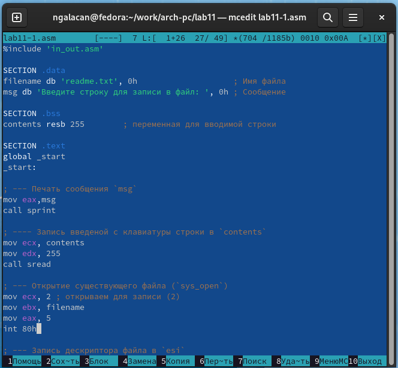
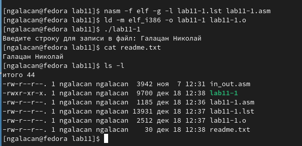
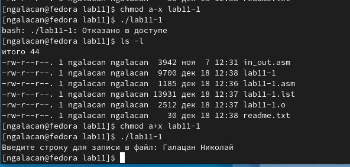
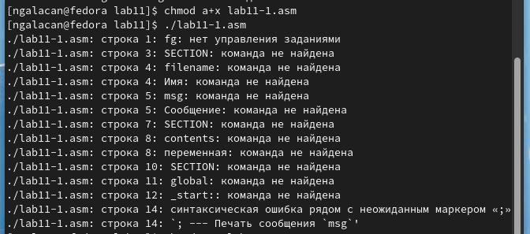
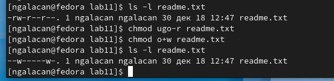
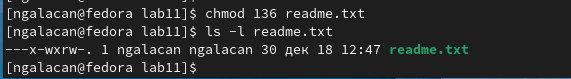
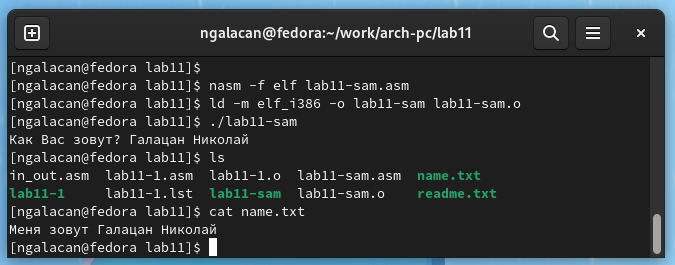

---
## Front matter
title: "Отчет по лабораторной работе №11"
subtitle: "*дисциплина: Архитектура компьютера*"
author: "Галацан Николай, НПИбд-01-22"

## Generic otions
lang: ru-RU
toc-title: "Содержание"

## Bibliography
bibliography: bib/cite.bib
csl: pandoc/csl/gost-r-7-0-5-2008-numeric.csl

## Pdf output format
toc: true # Table of contents
toc-depth: 2
lof: true # List of figures
fontsize: 12pt
linestretch: 1.5
papersize: a4
documentclass: scrreprt
## I18n polyglossia
polyglossia-lang:
  name: russian
  options:
	- spelling=modern
	- babelshorthands=true
polyglossia-otherlangs:
  name: english
## I18n babel
babel-lang: russian
babel-otherlangs: english
## Fonts
mainfont: PT Serif
romanfont: PT Serif
sansfont: PT Sans
monofont: PT Mono
mainfontoptions: Ligatures=TeX
romanfontoptions: Ligatures=TeX
sansfontoptions: Ligatures=TeX,Scale=MatchLowercase
monofontoptions: Scale=MatchLowercase,Scale=0.9
## Biblatex
biblatex: true
biblio-style: "gost-numeric"
biblatexoptions:
  - parentracker=true
  - backend=biber
  - hyperref=auto
  - language=auto
  - autolang=other*
  - citestyle=gost-numeric
## Pandoc-crossref LaTeX customization
figureTitle: "Рис."
tableTitle: "Таблица"
listingTitle: "Листинг"
lofTitle: "Список иллюстраций"
lolTitle: "Листинги"
## Misc options
indent: true
header-includes:
  - \usepackage{indentfirst}
  - \usepackage{float} # keep figures where there are in the text
  - \floatplacement{figure}{H} # keep figures where there are in the text
---

# Цель работы

Приобретение навыков написания программ для работы с файлами.

# Выполнение лабораторной работы

1. Ввожу команды для создания каталога лабораторной работы, перехожу в него, создаю файл `lab11-1.asm` и `readme.txt`: 
```
mkdir ~/work/arch-pc/lab11
cd ~/work/arch-pc/lab11
touch lab11-1.asm readme.txt
```
2. Ввожу в файл `lab11-1.asm` текст программы из листинга 11.1, сохраняю файл. (рис. [-@fig:1]).

{ #fig:1 width=70% }

Создаю исполняемый файл и запускаю его, предварительно скопировав файл `in_out.asm` в соответствующий каталог. С помощью команды `cat` проверяю содержимое текстового файла. Программа записала в него введенную с клавиатуры строку. Ввожу `ls -l`, чтобы проверить права доступа к файлам (рис. [-@fig:2]).

{ #fig:2 width=70% }

3. С помощью команды `chmod a-x lab11-1` изменяю права доступа к `lab11-1`, запретив выполнение. Введенна команда запрещает выполнение файла для всех групп пользователей. При попытке выполнения файла происходит отказ в доступе, файл не выполняется. Ввожу `ls -l` и убеждаюсь, что права для исполнения отозваны. Возвращаю права для исполнения, чтобы проверить, и снова запускаю файл. Файл исполняется корректно. (рис. [-@fig:3]).

{ #fig:3 width=70% }

4. С помощью команды `chmod a+x lab11-1.asm` изменяю права доступа к `lab11-1.asm`, добавив права на исполнение для всех групп пользователей. Выполняю файл. Выводятся многочисленные ошибки. Происходит попытка исполнения исходного кода программы без трансляции и компоновки, то есть без преобразования в машинный код. Так как процессор понимает не команды ассемблера, а машинный код, то попытка исполнения этого файла приводит к ошибкам.  (рис. [-@fig:4]).

{ #fig:4 width=70% }

5. Предоставляю права доступа к файлу `readme.txt` в соответствии с 4 вариантом по таблице 11.4. Необходимо предоставить следующие права: 

* в символьном виде: `-w- --- -w-`:

Проверяю действующие права доступа к файлу. Отзываю права на чтение для всех групп. Добавляю права на запись для прочих пользователей. С помощью `ls -l readme.txt` проверяю установленные права доступа. Они соответствуют варианту (рис. [-@fig:5]).

{ #fig:5 width=70% }

* в двоичной системе: `001 011 110`:

По таблице 11.1 нахожу соответствие двоичного способа восьмеричному. Двоичное "001" соответствует восьмеричному "1"; "011" соответствует "3"; "110" соответствует "6". Ввожу `chmod 136 readme.txt`. Это означает, что владельцу доступно исполнение файла, группе владельца - запись и исполнение, прочим пользователям - чтение и запись. Проверяю права доступа (рис. [-@fig:6]).

{ #fig:6 width=70% }

# Выполнение заданий для самостоятельной работы

Необходимо написать программу, работающую по следующему алгоритму:

* Вывод приглашения “Как Вас зовут?”
* ввести с клавиатуры свои фамилию и имя
* создать файл с именем `name.txt`
* записать в файл сообщение “Меня зовут”
* дописать в файл строку введенную с клавиатуры
* закрыть файл

Создаю файл `lab11-sam.asm` и набираю текст программы:

```
%include 'in_out.asm'

SECTION .data
filename db 'name.txt', 0h                    ; Имя файла
msg db 'Как Вас зовут? ', 0h 	; Сообщения
msg2 db 'Меня зовут ', 0h

SECTION .bss
contents resb 255        ; переменная для вводимой строки

SECTION .text
global _start
_start:

; --- Печать сообщения `msg`
mov eax,msg
call sprint

; ---- Запись введеной с клавиатуры строки в `contents`
mov ecx, contents
mov edx, 255
call sread

; --- Создание файла (`sys_creat`)
mov ecx, 0777o ; права доступа
mov ebx, filename ; имя файла
mov eax, 8
int 80h

; --- Запись дескриптора файла в `esi`
mov esi, eax

; --- Расчет длины msg2
mov eax, msg2     ; в `eax` запишется количество
call slen         ; введенных байтов

; --- Записываем в файл "Меня зовут " (`sys_write`)
mov edx, eax
mov ecx, msg2
mov ebx, esi
mov eax, 4
int 80h

; --- Расчет длины введенной строки
mov eax, contents ; в `eax` запишется количество
call slen         ; введенных байтов

; --- Записываем в файл `contents` (`sys_write`)
mov edx, eax
mov ecx, contents
mov ebx, esi
mov eax, 4
int 80h

; --- Закрываем файл (`sys_close`)
mov ebx, esi
mov eax, 6
int 80h

call quit
```

Создаю исполняемый файл, проверяю его работу. На запрос ввожу имя и фамилию. Проверяю наличие созданного текстового файла, вывожу его содержимое. Программа выполнена правильно (рис. [-@fig:7]).

{ #fig:7 width=70% }

# Выводы

Приобретены навыки написания программ для работы с файлами средствами NASM. Были изучены права доступа к файлам и способы их изменения.
